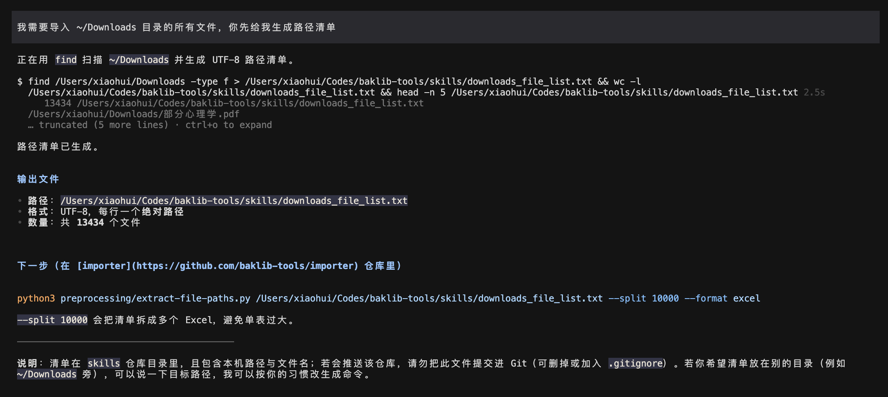
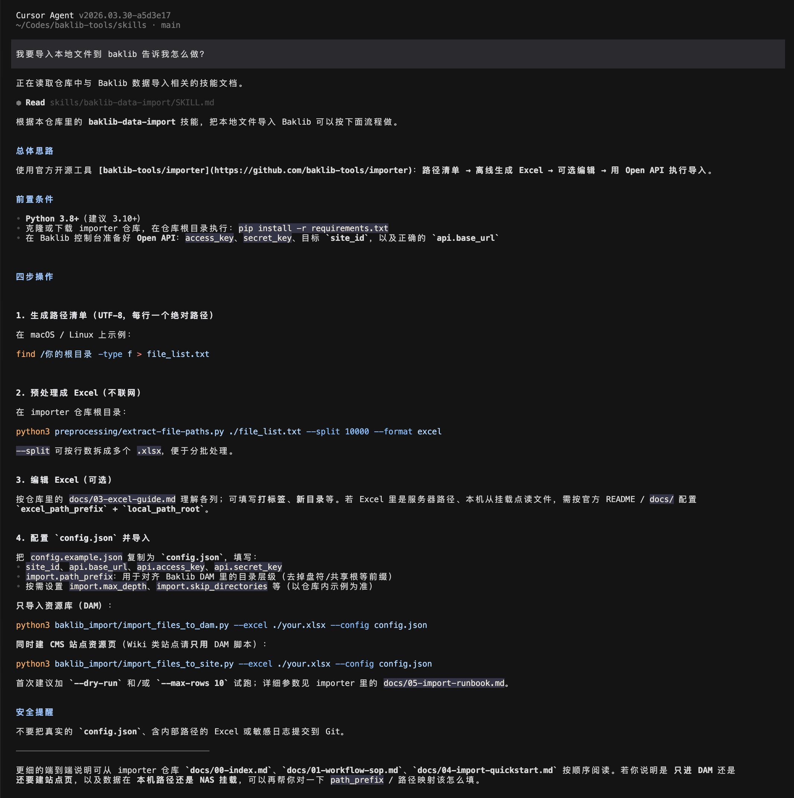

# 示例：用 **baklib-data-import** 技能完成本地文件批量导入

本文档配合截图，演示在 Cursor 等编辑器里如何通过 **baklib-data-import** 技能，把「路径清单 → Excel → Open API 导入」这条流程跑通。技能全名：`baklib-data-import`（仓库路径：`skills/skills/baklib-data-import/SKILL.md`）。

下图已**内嵌为 Base64**，单文件即可预览，不依赖同级 `images/` 目录（仓库中仍保留原 PNG 便于单独引用）。

**前提**：本机已安装 Python 3.8+，并已克隆 [baklib-tools/importer](https://github.com/baklib-tools/importer)，在仓库根目录执行过 `pip install -r requirements.txt`；同时具备 Baklib Open API 的密钥与站点信息。

---

## 向智能体说明导入场景

在对话中描述你的环境与目标（例如：批量把某 NAS/本地目录迁入 Baklib DAM、是否需要站点资源页、数据量级等）。智能体应匹配 **baklib-data-import** 技能，并按技能给出的步骤引导你生成路径清单、预处理与配置导入，而不是臆造 API 字段。



**这一阶段通常对应技能中的**：路径清单（`find` 等）→ `preprocessing/extract-file-paths.py` 生成 Excel → 按需编辑「打标签」「新目录」。

---

## 按技能指引执行命令与检查输出

根据技能中的命令示例，在 **importer 仓库根目录** 执行预处理与导入脚本；首次导入建议使用 `--dry-run` 或 `--max-rows` 小批量验证。Wiki 类站点仅使用「仅 DAM」导入脚本；CMS 站点才使用「DAM + 站点页」脚本。



**常用命令速查**（路径相对 importer 根目录）：

```bash
# 预处理：清单 → 分类拆分 Excel（不访问网络）
python3 preprocessing/extract-file-paths.py ./file_list.txt --split 10000 --format excel

# 仅 DAM
python3 baklib_import/import_files_to_dam.py --excel ./your.xlsx --config config.json

# DAM + CMS 站点资源页
python3 baklib_import/import_files_to_site.py --excel ./your.xlsx --config config.json
```

---

## 流程小结


| 步骤  | 内容                                                                                                               |
| --- | ---------------------------------------------------------------------------------------------------------------- |
| 1   | 导出 UTF-8 路径清单，每行一个绝对路径                                                                                           |
| 2   | `extract-file-paths.py` 生成 Excel，可选填标签与目标目录                                                                      |
| 3   | 复制 `config.example.json` 为 `config.json`，填写 API 与 `import.path_prefix` 等                                         |
| 4   | 执行 `import_files_to_dam.py` 或 `import_files_to_site.py`；长周期导入后的增量可用 `preprocessing/compare_file_lists.py` 再筛新增文件 |


更完整的列说明、NAS 路径映射与 Runbook 参数见 importer 仓库内 `docs/`（技能文档末尾有索引表）。

**安全提醒**：勿将真实 `config.json`、含内部路径的 Excel 或敏感日志提交到 Git。