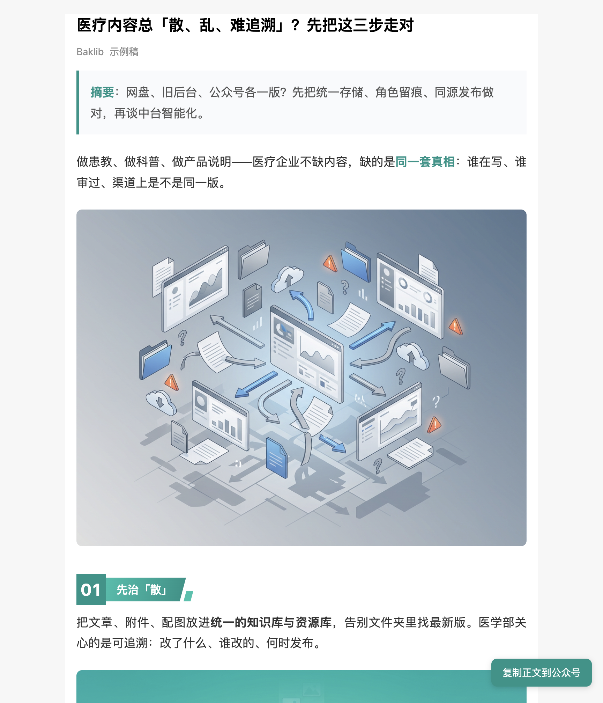

# 示例：requirements-to-published-content（医疗健康 CMS 需求 → 对外内容与公众号）

本目录演示技能 **[requirements-to-published-content](../../skills/requirements-to-published-content/SKILL.md)** 的端到端用法：把**脱敏后的客户需求**与**本地 Baklib 产品知识**结合，依次产出需求分析、正式方案、推广向案例叙事、对外长文、公众号稿，并由模型**自行推导**配图思路（见 `artifacts/image-plan-from-content.md`）。

## 前提条件

### 1. 安装技能（在目标项目中）

```bash
npx skills add baklib-tools/skills --skill requirements-to-published-content --skill wechat-mp-html
# 可选：站点发布、BKE 正文、配图
npx skills add baklib-tools/skills --skill baklib-mcp --skill baklib-bke-markdown
npx skills add baklib-tools/skills --skill image-generation --skill nano-banana-pro-prompting
```

### 2. 在 Cursor 中挂载 Baklib 产品知识库（必做，标准流程）

将**本机**存放 Baklib 产品知识（镜像、方案稿等）的目录加入工作区。下文用目录名 **`baklib-workspace`** 指代该根目录；**磁盘绝对路径由你自定**（例如 `~/baklib-workspace`、`~/dev/baklib-workspace`），勿使用他人机器上的路径。

请使用 **多根工作区（Add Folder to Workspace）** 或同时打开：

- 本仓库 `skills`（含 `examples/`）；以及  
- 上述 **`baklib-workspace`** 根目录。

使 Agent 能 **Read** 其中与产品能力相关的 Markdown，例如：

- `baklib-mirror/知识库/` 下与**产品功能、售前、FAQ**相关的文章（具体子路径以你方镜像为准）；  
- 若有，营销/方案类成稿目录。

**不要**把整库正文复制进本仓库；示例只随仓库携带 [fixtures/requirement-input-desensitized.md](fixtures/requirement-input-desensitized.md)。

若你**没有**该目录，可临时阅读 [fixtures/product-notes-stub.md](fixtures/product-notes-stub.md) 的降级说明（能力边界以官网为准）。

### 3. 客户输入

复制 [fixtures/requirement-input-desensitized.md](fixtures/requirement-input-desensitized.md) 到对话，作为「客户材料」。

---

## 公众号 HTML 效果预览（浏览器全页截图）

下图由 **Cursor 浏览器 MCP** 访问本地预览页并 **`fullPage: true`** 截取，展示 [artifacts/06-wechat-article.html](artifacts/06-wechat-article.html) 的版式、三帧配图与右下角「复制正文到公众号」按钮。



**本地复现**：在 `artifacts/` 目录启动静态服务后打开 `06-wechat-article.html`（勿用 `file://`，便于剪贴板与相对路径图片加载）：

```bash
cd examples/requirements-to-published-content-health-cms/artifacts
python3 -m http.server 9877 --bind 127.0.0.1
# 浏览器打开 http://127.0.0.1:9877/06-wechat-article.html
```

更新全页截图时：在同样环境下由浏览器自动化整页截图，覆盖本目录下 `wechat-html-demo-fullpage.png` 即可。

---

## 本示例中的产物（artifacts）

| 文件 | 说明 |
|------|------|
| [artifacts/01-requirement-analysis.md](artifacts/01-requirement-analysis.md) | 需求结构化分析 |
| [artifacts/02-formal-proposal-baklib.md](artifacts/02-formal-proposal-baklib.md) | 正式方案：可响应 / 部分 / 不可响应与分期 |
| [artifacts/03-promotional-case-study.md](artifacts/03-promotional-case-study.md) | **虚构企业**软文案例（推广 Baklib） |
| [artifacts/04-public-article.md](artifacts/04-public-article.md) | 对外传播用 Markdown 长文 |
| [artifacts/05-wechat-article.md](artifacts/05-wechat-article.md) | 公众号图文定稿（Markdown） |
| [artifacts/06-wechat-article.html](artifacts/06-wechat-article.html) | 同主题公众号 HTML 示例（`#js_content` + 复制按钮；配图见 [artifacts/images/](artifacts/images/)） |
| [artifacts/image-plan-from-content.md](artifacts/image-plan-from-content.md) | 由文案推导配图与三镜头（非用户逐张指定） |

**模拟对话步骤**见 [walkthrough/simulated-dialogue.md](walkthrough/simulated-dialogue.md)。

---

## 与技能阶段 A–G 的对应关系

| 技能阶段 | 本示例中的体现 |
|----------|----------------|
| A 采集与澄清 | `fixtures` 客户材料 + 首轮指令：先读 `baklib-workspace` |
| B 分析与结构化 | `01-requirement-analysis.md` |
| C 方案与设计 | `02-formal-proposal-baklib.md` |
| D 对外文稿 | `03`、`04` |
| E 渠道排版 | `05`、[`wechat-mp-html`](../../skills/wechat-mp-html/SKILL.md)、`06` |
| F 配图 | `image-plan-from-content.md`（提示词由模型从正文推导） |
| G 站点发布 | 可选；需用户确认后使用 `baklib-mcp`，本示例不默认执行写入 |

---

## 合规说明

- 示例中**企业名、数据均为虚构**；不涉及真实客户与内网链接。  
- 正式售前以**当前产品版本**与**贵司知识库**为准，勿将本示例当作合同承诺。
