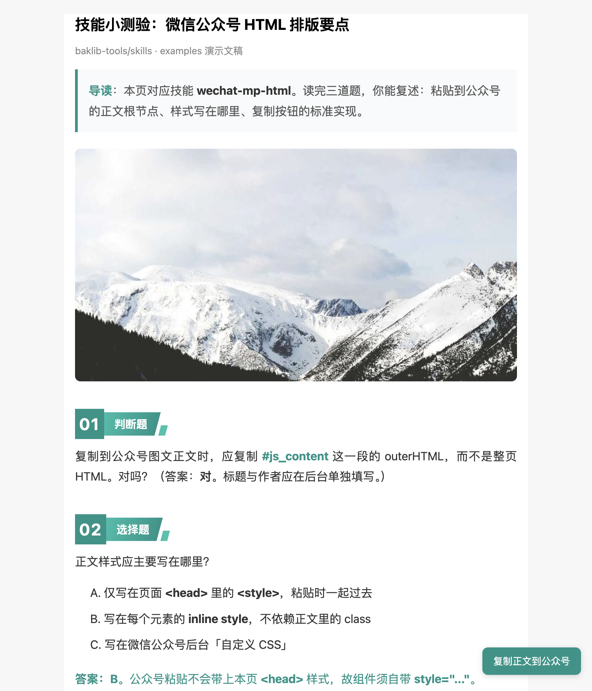

# 示例：用 **wechat-mp-html** 技能排版「公众号 HTML 小测验」

本示例演示在已加载技能 **[wechat-mp-html](../../skills/wechat-mp-html/SKILL.md)** 的前提下，如何产出**可本地预览、一键复制 `#js_content` 到公众号后台**的 HTML 页面。

## 文件说明

| 文件 | 说明 |
|------|------|
| [article-quiz-demo.html](article-quiz-demo.html) | 完整示例页：导读、数字步骤标题、章节主标题、总结框、标准「复制正文到公众号」按钮与 `ClipboardItem` 脚本 |
| [quiz-demo-fullpage.png](quiz-demo-fullpage.png) | 浏览器 **全页截图**（见下），展示排版与右下角复制按钮 |

## 效果预览（全页截图）

下图由 **Cursor 浏览器 MCP** 访问本地页面并 **`fullPage: true`** 截取，便于在文档中直接查看版式效果。



## 本地自行打开

1. 在仓库内进入本目录，启动静态服务（**请勿使用 `file://` 打开**，部分浏览器对剪贴板 API 限制更严）：

   ```bash
   cd examples/wechat-mp-html-quiz
   python3 -m http.server 9876 --bind 127.0.0.1
   ```

2. 浏览器访问：`http://127.0.0.1:9876/article-quiz-demo.html`

3. 点击右下角 **「复制正文到公众号」**，在公众平台图文编辑器中粘贴试效果。

## 与技能文档的对应关系

- 正文根节点 **`#js_content`**、**inline style**、**`#copy-to-weixin` / `#copy-toast`**：见技能 [references/constraints.md](../../skills/wechat-mp-html/references/constraints.md)。
- 数字标题、章节主标题、总结框等 HTML 片段：见 [references/components.md](../../skills/wechat-mp-html/references/components.md)。

## 重新生成全页截图（维护者）

在已启动上述 `http.server` 的前提下，使用浏览器自动化打开 `http://127.0.0.1:9876/article-quiz-demo.html`，对整页截图并覆盖本目录下的 `quiz-demo-fullpage.png` 即可（Cursor **浏览器 MCP** 不支持 `file://` URL）。
